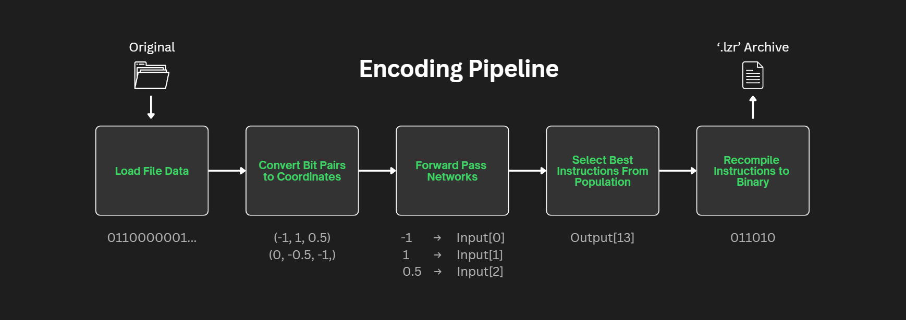
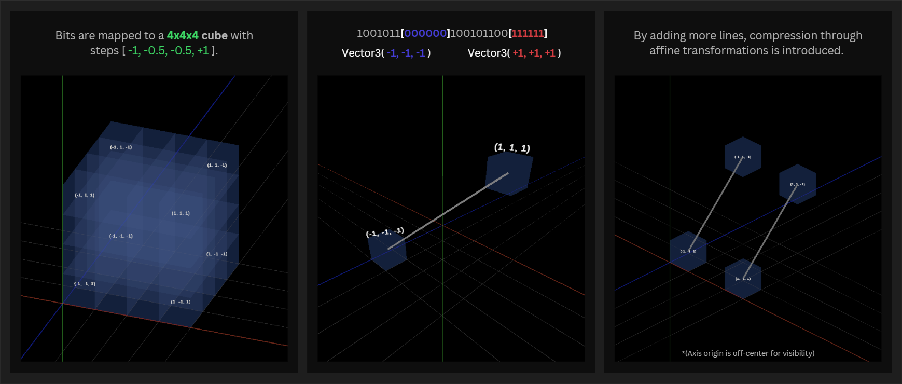

   
<p align="center">
   <a>Research-based data codec leveraging neuroevolution, binary-to-coordinate projection, affine transformations, and traditional LZ-adjacent reduction techniques.</a>
</p>

<p align="center">
   <a href="https://go.dev"></a>
   <a href="LICENSE"></a>
   <a href="https://github.com/derekhandy/ngen-laser/actions/workflows/ci.yml/badge.svg?branch=main"></a>
   <a href="https://github.com/derekhandy/ngen-laser/releases"></a>
   <a href="https://discord.gg/yB9M3fnqm"></a>
</p>

<div align="center">
   <a href="#features">Features</a> &bull;
   <a href="#overview">Overview</a> &bull;
   <a href="#requirements">Requirements</a> &bull;
   <a href="#installation">Installation</a> &bull;
   <a href="#quick-start">Quick Start</a> &bull;
   <a href="#usage">Usage</a><br> &bull;
   <a href="#configuration">Configuration</a> &bull;
   <a href="#data-directory-layout">Data Directory Layout</a> &bull;
   <a href="#project-structure">Project Structure</a> &bull;
   <a href="#package-format">Package Format</a><br> &bull;
   <a href="#contributing">Contributing</a> &bull;
   <a href="#security">Security</a> &bull;
   <a href="#license">License</a>
      
</div>

---

## Features

### Codec
- Lossless data compression
- Archive path traversal protection and root-confined restore
- Parsing schema for binary to 3D coordinates
- Affine math-based and traditional string-based compression commands
- Packages stored in `.lzr` format

### AI
- GRU recurrent state plus multi-head attention encoder layers
- Extensive JSON configuration for network suite
- CSV analytics written post generation
- Atomic file writing for weights

### General
- CPU and memory monitoring / thresholds
- Thread-safe parallel processing
- Extensive tests for edge cases
- Cross-platform support

---

## Overview

LASER is an in-development data compression codec written in Go. Its purpose is to explore a range of binary representations, transformations, and encoding approaches for lossless compression.
> LASER is not intended to replace existing compression solutions, business or personal, and does not benchmark higher than mainstream software. Readers seeking stable, well-benchmarked compression are referred to https://quixdb.github.io/squash-benchmark/ for more information regarding standard solutions.



**Encoding Pipeline 1.1**

- The process begins by loading file binaries, segmenting them by packet size, and converting the data into a sequence of 3D coordinates.
- These positions are supplied as input to a generation of neural networks, which are evaluated over a series of command proposal rounds.
- As networks train on a file or directory, each evolution iteratively refines the data toward smaller packed instruction representations until either the configured number of generations is reached or the compression threshold is met.



**Encoding Pipeline 1.2**

- Networks select both math-based commands, such as rotation and mirroring, and LZ-style techniques, including dictionary indexing and copy operations.
- Encoding is performed exclusively by the networks; decoding is purely computational and does not require any weights.
- The output of training and packaging is a .lzr archive containing instructions for procedurally regenerating the original data.

The project's broader aim is to evaluate additional approaches to the same problem, including various polygon types for binary-to-coordinate mappings, higher-resolution coordinate spaces, affine transformations in four or more dimensions, and physics- or time-based procedural encodings. These directions have not yet been implemented or evaluated.

---

## Requirements

- **Go 1.22+**
- Linux, MacOS, or Windows

---

## Installation

### Pre-built binaries

Download the `.tar.gz` for your platform from the [releases page](https://github.com/derekhandy/ngen-laser/releases), extract it,
and run the binary.

On Windows 10 or later: 
```bash
tar -xzf <release-name>.tar.gz
<release-name>.exe help
```

### Go Build

```bash
git clone https://github.com/derekhandy/ngen-laser.git && cd laser
go mod tidy
go build -o laser .
```

---

## Quick Start

```bash
# Train networks and compress <path>
./laser train <path>

# Train with an explicit compression-ratio write threshold
./laser train <path> -t 0.85

# Restore a .lzr package
./laser unpack <path>
```

The optional `-t <comp-ratio>` flag overrides `thresholdCompToWrite` from
`training-flags.json` for that run only. Values are floats in `[0, 1]`;
`0` disables the threshold. The JSON file on disk is not modified.

Note:
Using the default configuration values is recommended on first-time rollout.

---

## Usage

### Compression
   
**Training Flags**

1. Set `thresholdCompToWrite` to desired package %size (0.0-1.0).
```json
   "debugMode": false,
   "thresholdCompToWrite": 0.7,
   "endTrainingOnThreshold": true,
```
   
**Training Config**

2. Set `numOfGenerations` and `populationSize`.
```json
    "iterationLimit": 1,
    "numOfGenerations": 20,
    "populationSize": 100,
    "mutationPercent": 0.05,
```

3. Train on file or directory.
```text
train <path>
```

### Decompression

1. Decompress file at path.
```text
unpack <path>
```

Unpacking restores files beneath a `<original-name>-restore` directory and rejects paths that escape the restore root.
Anyone with LASER can decompile all `.lzr` files without needing the weights of the neural network that generated them.

---

## Configuration

LASER reads JSON configuration from the laser/data directory:

| File | Purpose |
|---|---|
| `config/training-config.json` | Training population, generations, mutation, crossover, architecture. |
| `config/solving-config.json` | Packaging/solving configuration. |
| `config/environment-rubric.json` | Reward and penalty shaping for fitness. |
| `config/training-flags.json` | Runtime toggles for analytics, network writes, debug mode, and operation allowlists. |

### Key training configuration fields

| Field | Meaning |
|---|---|
| `iterationLimit` | Base network steps per evaluation. |
| `numOfGenerations` | Number of evolutionary generations. |
| `populationSize` | Number of networks in the population. |
| `mutationPercent` | Fraction of weights mutated. |
| `mutationStrength` | Standard deviation of mutation noise. |
| `dynamicTemperature` | Enables temperature-based sampling during training. |
| `allowStopping` | Allows networks to emit a stop decision. |
| `passes` | Number of passes each generation gets per item. |
| `inputSize` | Network input size. |
| `hiddenLayers` | Backbone hidden layer sizes. |
| `elitePercent` | Fraction of top networks preserved unchanged. |
| `mutatedElitePercent` | Fraction of top networks mutated. |
| `crossoverPercent` | Fraction of offspring produced by crossover. |
| `newInitPercent` | Fraction of fresh randomly initialized networks. |

### Key training flags

| Flag | Meaning |
|---|---|
| `writeGenerationAnalytics` | Write per-generation CSV analytics. |
| `generationBasedNetworkWrite` | Save elite networks every N generations. |
| `writeNetworksGenerationInterval` | Generation interval for network writes. |
| `timeBasedNetworkWrite` | Save networks based on elapsed time. |
| `writeNetworksIntervalTime` | Time interval in seconds for network writes. |
| `warmupMemory` | Warm up memory/state before training. |
| `debugMode` | Enable debug logging and pauses. |
| `thresholdCompToWrite` | Compression ratio threshold for writing packages. |
| `endTrainingOnThreshold` | Stop training once the threshold is reached. |
| `allowStringOperations` | Enable string-oriented operands. |
| `allowMathOperations` | Enable math/geometry-oriented operands. |

---

## Data Directory Layout

```text
data/
├── config/
│   ├── training-config.json
│   ├── solving-config.json
│   ├── environment-rubric.json
│   └── training-flags.json
├── weights/
│   ├── elite_0.json
│   ├── elite_1.json
│   └── ...
└── analytics/
    └── <safe-guid>/
        └── analytics.csv
```

- `weights/elite_*.json` stores saved elite networks.
- `analytics/<safe-guid>/analytics.csv` stores generation metrics when enabled.

---

## Project Structure

| File / Area | Responsibility |
|---|---|
| `main.go` | CLI entrypoint and command dispatch. |
| `core_app.go` | App paths, rollout state, data root resolution, flag parsing. |
| `core_constants.go` | Global constants, packet token kinds, codec constants. |
| `data_codec.go` | BitOps binary encoding/decoding and glyph/operand conversion. |
| `data_commands.go` | Compression commands, exhaustive search, operand spellings. |
| `data_file_operations.go` | Binary/text conversion, atomic writes, path helpers. |
| `data_instructions.go` | Instruction interpreter, renderer, operations, index handling. |
| `data_packaging.go` | Tree/container packaging, `.lzr` build/restore, package records. |
| `data_packet_tokens.go` | Compact packet token parsing, encoding, and size calculation. |
| `memory_attention.go` | Attention layers and forward pass. |
| `memory_hybrid.go` | Hybrid memory controller: GRU + attention encoder. |
| `memory_state.go` | Recurrent state and GRU update logic. |
| `network_config.go` | Config loading, training/packaging preparation, validation. |
| `network_default.go` | Default architecture, output heads, sampling, decoding. |
| `network_environment.go` | Compression environment, step logic, rewards, state. |
| `network_evaluation.go` | Population evaluation and fitness shaping. |
| `network_evolution.go` | Evolution, mutation, crossover, cloning, selection. |
| `network_forward.go` | Forward pass, input encoding, operation application. |
| `network_io.go` | Network serialization/deserialization. |
| `network_packaging.go` | Packaging rollout and forward-pass instructions. |
| `network_train.go` | Training rollout, analytics, generation loop. |

For a deeper description of the network itself, see [`docs/ARCHITECTURE.md`](docs/ARCHITECTURE.md).

---

## Package Format

`.lzr` packages use a custom framing:

- Header starts with `‰LASER`
- Package framing begins with `LASER-PACKAGE-V4\x00`
- Records contain three length-prefixed fields:
  1. part name
  2. archived relative path
  3. BitOps binary payload

Payloads are encoded with a compact BitOps binary codec that supports bit runs, fixed operands, magnitude operands, directional operands, axis operands, index operands, variable references, and raw operand runs.

Unpacking restores files beneath a `-restore` directory and rejects paths that escape the restore root.

---

### Operation groups

- **String operations:** `h`, `k`, `e`, `o`, `i`, `b`, `g`, `l`
- **Math operations:** `t`, `f`, `x`, `y`, `z`, `r`, `m`, `d`, `n`

---

## Contributing

Contributions are welcome and encouraged. See [`CONTRIBUTING.md`](CONTRIBUTING.md) for details.

In General:

1. Fork the repository.
2. Create a feature branch.
3. Keep changes formatted with `gofmt`.
4. Run `go vet ./...`, `go test ./...`, and `go test -race ./...`.
5. Open a pull request with a clear description.

For large changes, please open an issue first to discuss the design or join the discord [here.](https://discord.gg/yB9M3fnqm)

---

## Security

LASER includes protections against common archive restore issues:

- Restore paths are confined to the restore root.
- Absolute paths and `..` traversal are rejected.
- Network weights are written atomically.
- Package records validate field lengths before reading.

To report a vulnerability, please see [`SECURITY.md`](SECURITY.md) or open a private security advisory on GitHub.

> **Note:** LASER is experimental compression software. Always keep independent backups. Do not rely on it as your only archival method.

---

## License

Apache-2.0 License. See [LICENSE](LICENSE) for details.

Copyright (c) 2026 Derek Handy.

---
